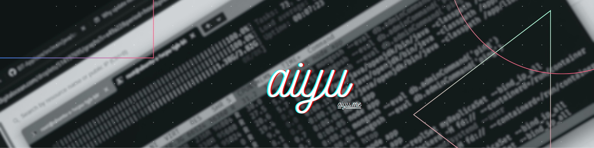

### Hey 👋, I'm Ayaan


[](https://github.com/aiyu-ayaan)
<a href="http://www.github.com/aiyu-ayaan">  </a>
[](https://wakatime.com/@3a4240f0-6bea-4626-be2a-1129790e4336)

```kotlin
val bio = """
    Shipping production systems through agentic, spec-first workflows 🤖
    Architecture, threat model, and phased backlog as machine-readable context
    AI coding agents execute against a contract — I own review, integration, and hardening ✨
    Open Source is my passion—building with modern tech and AI patterns! ❤️
"""
```

```kotlin
val ayaan = developer {
    about {
        name = "Ayaan Ansari 🚀"
        role = "Software Engineer | AI-Assisted & Agentic Development"
        location = "Mumbai, Maharashtra"
        description = """
            |Engineer who ships production systems through agentic, spec-first workflow
            |Recent: 8-service E2EE communication platform (desktop, web, Android), multi-agent Android framework, AI-powered SaaS
            |Day job: C#, Azure Functions, APIM, .NET Core on live client engagements at Adrosonic 💼
            |Passionate about architecture-driven development, LLM integration, and modern patterns ✨
        """.trimMargin()
    }
    
    tech {
        languages("TypeScript", "Kotlin", "Python", "C#", "Go", "Java", "SQL")
        frameworks {
            +"NestJS • Fastify • Express • FastAPI • .NET Core"
            +"Next.js • React • Tailwind • Electron • Jetpack Compose • Kotlin Multiplatform"
            +"WebRTC • WebSockets • Firebase • Ktor"
        }
        aiTools("LangChain", "Vercel AI SDK", "Gemini API", "OpenAI", "Claude", "Groq", "OpenRouter", "n8n")
        tools("Docker • GitHub Actions • Prisma • Room • PostgreSQL • MongoDB • Redis • k6 • pnpm + Turborepo")
        architectures("Microservices", "Clean Architecture", "MVVM", "E2EE (AES-256-GCM)", "Repository Pattern", "Dependency Injection")
    }
    
    links {
        linkedin = "https://www.linkedin.com/in/aiyu"
        github = "https://github.com/aiyu-ayaan"
        email = "ayaan35200@gmail.com"
    }
    
    education {
        Education(
            institution = "🎓 BIT Mesra",
            program = "MCA (Master of Computer Applications)",
            timeline = "Aug 2023 - May 2025",
            cgpa = "8.1/10.0"
        )
        
        Education(
            institution = "🎓 BIT Mesra",  
            program = "BCA (Bachelor of Computer Applications)",
            timeline = "Aug 2019 - May 2022",
            cgpa = "8.2/10.0"
        )
    }
    
    experience {
        Experience(
            company = "💼 Adrosonic",
            role = "Software Engineer",
            duration = "Jun 2025 - Present",
            location = "Mumbai, Maharashtra",
            achievements = listOf(
                "• Own delivery on two live client projects using C#, .NET Core, Azure Functions, and APIM",
                "• Integrated Gemini into Azure Functions as reusable serverless LLM entry point",
                "• Use AI coding agents as daily multiplier — brief, review, integrate against written architecture"
            )
        )
        
        Experience(
            company = "💼 Adrosonic",
            role = "Software Engineer (Trainee) - Internship",
            duration = "Dec 2024 - Jun 2025",
            location = "Mumbai, Maharashtra", 
            achievements = listOf(
                "• Developed enterprise POC for Dynamics 365 + Instanda integration, cutting process automation time by 40%",
                "• Delivered WordPress and .NET Framework web work alongside enterprise solutions",
                "• Redesigned office website UI/UX — 30% faster load times, 20% higher engagement"
            )
        )
        
        Experience(
            company = "💼 BeyondSchool",
            role = "Android Developer Intern",
            duration = "Jul 2022 - Mar 2023",
            location = "Ranchi, Jharkhand",
            achievements = listOf(
                "• Shipped TTS/STT accessibility features — 35% increase in engagement",
                "• Designed gamification with rewards and leaderboards — 40% boost to retention", 
                "• Optimized app flow reducing drop-off rates by 25%"
            )
        )
    }
    
    featuredProjects {
        Project(
            name = "🔐 BetweenUs",
            description = "Secure Discord-style E2EE communication platform with desktop (Electron), web (React), and native Android (Compose) clients",
            tech = "NestJS • TypeScript • Electron • React • Kotlin/Compose • WebRTC • PostgreSQL • Redis • AES-256-GCM",
            achievements = listOf(
                "• 8 NestJS microservices (auth, server, chat, presence, notifications, call-service, admin) behind Nginx :8080",
                "• Implemented E2EE messaging (WebCrypto on Desktop/Web, javax.crypto on Android) — server sees only ciphertext",
                "• Engineered P2P WebRTC mesh with zero media server — call-service does signalling only, media streams direct via DTLS-SRTP",
                "• Caught and fixed three authorization flaws in agent-written code; wrote CLAUDE.md, development/E2EE.md, and decision logs"
            ),
            link = "https://github.com/aiyu-ayaan/BetweenUs"
        )
        
        Project(
            name = "📊 LoadPulse", 
            description = "Website performance testing workspace with AI-powered k6 script generation via Gemini, Groq, OpenRouter",
            tech = "React • Node.js/Express • MongoDB • Socket.IO • k6 • Redis • Gemini/Groq/OpenRouter",
            achievements = listOf(
                "• Live dashboard via Socket.IO, concurrent k6 execution, cron + API hook integrations",
                "• Redis-backed API caching, MongoDB field-level encryption, PM2 cluster mode scheduler singleton",
                "• AI k6 script generation from natural language — custom metrics, thresholds, ramp-up profiles",
                "• GitHub OAuth + TOTP 2FA, admin console, test history search/stop"
            ),
            link = "https://github.com/aiyu-ayaan/LoadPulse"
        )
        
        Project(
            name = "🌟 Aiyu - Portfolio & CMS",
            description = "Production-grade portfolio CMS with AI Neural Core (Gemini), visual task scheduler, MCP server, and 52 preset themes",
            tech = "Next.js 16 • React 19 • PostgreSQL • Prisma • Gemini • Docker • TailwindCSS",
            achievements = listOf(
                "• Gemini AI Neural Core generating 64+ token design systems from prompts, project naming, tech-stack mapping",
                "• Visual 60s cron scheduler with n8n-style fixed/expression toggles, AES-256 encrypted ${env.KEY} secrets, dynamic ${site}/${device} variables",
                "• 52 preset themes (Dracula, Tokyo Night, Nord, Cyberpunk, Catppuccin), Markdown blog with Notion sync, full-screen LaTeX resume IDE with AI refinement",
                "• Exposed MCP server with custom tools; dual-routed webhooks to n8n, Discord, Telegram, ntfy; live server health monitoring and AI log analyzer"
            ),
            link = "https://github.com/aiyu-ayaan/Aiyu"
        )
        
        Project(
            name = "🎓 BIT App",
            description = "University student portal with 1000+ users and 4.7/5 Play Store rating",
            tech = "Android • Kotlin • Firebase • MVVM • Room • WorkManager",
            achievements = listOf(
                "• Custom analytics dashboard for usage monitoring and feature development",
                "• Efficient background tasks via WorkManager and local Room database storage"
            ),
            link = "https://play.google.com/store/apps/details?id=com.atech.bit"
        )
    }
    
    exploring {
        +"Agentic coding workflows and spec-first development"
        +"Multi-agent orchestration and LLM API integration"
        +"E2EE and cryptographic protocols"
        +"Microservices architecture and system design"
        +"Enterprise .NET and cloud patterns"
    }
}
```

## 📊 **My GitHub Stats**

<br>

<a href="http://www.github.com/aiyu-ayaan"> 
    
</a>

<a href="http://www.github.com/aiyu-ayaan"> 
    
</a>

---

*"Shipping production systems through agentic workflows, one commit at a time."* ✨
